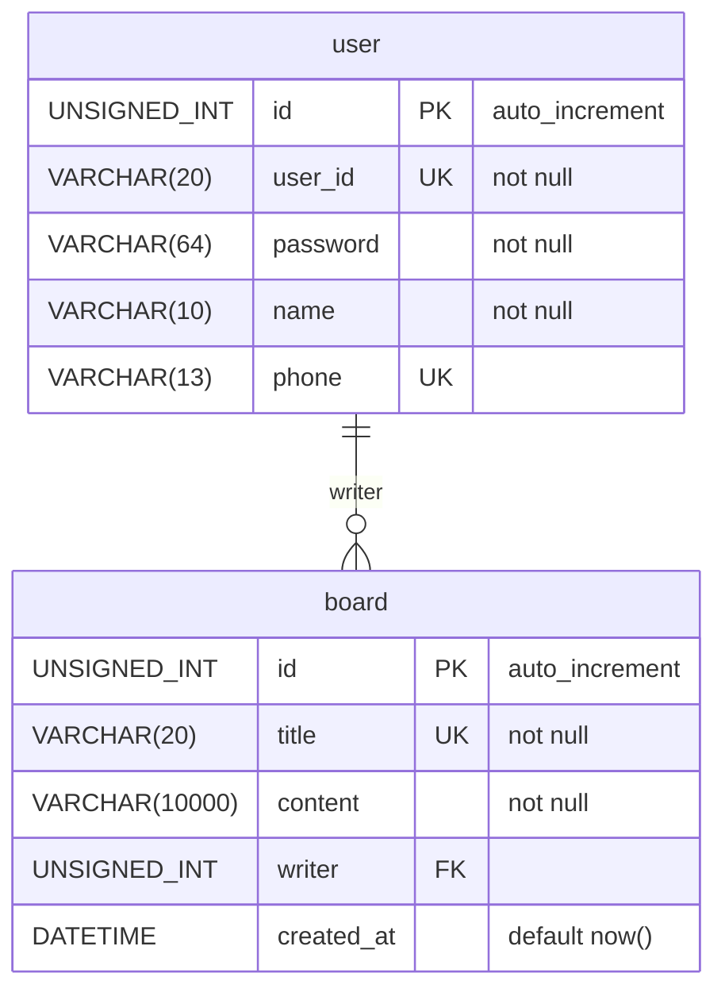

# Relational

## user 생성

```sql
CREATE TABLE user (
    id INT UNSIGNED PRIMARY KEY AUTO_INCREMENT,
    user_id VARCHAR(20) NOT NULL UNIQUE,
    password VARCHAR(64) NOT NULL,
    name VARCHAR(10) NOT NULL,
    phone VARCHAR(13) UNIQUE
);
```

```html
<div>안녕하세요~ </div>
```

```sql
INSERT INTO user (user_id, password, name) VALUES ('test', '1234', '이정배'), ('carrot','4321','박성민');
```

## board 생성

```sql
CREATE TABLE board (
    id INT UNSIGNED PRIMARY KEY AUTO_INCREMENT,
    title VARCHAR(20) NOT NULL UNIQUE,
    created_at DATETIME DEFAULT NOW(),
    writer INT UNSIGNED,
    content VARCHAR(10000) NOT NULL
);
INSERT INTO board (title, writer, content) VALUES ('타이틀입니다.', 2, '첫글');
INSERT INTO board (title, writer, content) VALUES ('타이틀입니다1.', 2, '첫글1');
INSERT INTO board (title, writer, content) VALUES ('타이틀입니다2.', 3, '첫글2');

SELECT * FROM board; -- 작성자의 id를 찾을 수 있다.
SELECT * FROM user WHERE id=1;
```

## user 삭제

```sql
DROP TABLE user; -- 되네?
```

## board와 user의 관계

```sql
DROP TABLE IF EXISTS board;

CREATE TABLE board (
    id INT UNSIGNED PRIMARY KEY AUTO_INCREMENT,
    title VARCHAR(20) NOT NULL UNIQUE,
    created_at DATETIME DEFAULT NOW(),
    writer INT UNSIGNED,
    content VARCHAR(10000) NOT NULL,
    FOREIGN KEY (writer) REFERENCES user(id) -- 외래키(FOREIGN KEY)를 사용하여 관계를 DB에게 알려줌
    ON UPDATE CASCADE -- user가 수정되면 writer 똑같이 수정
    ON DELETE SET NULL -- user가 지우면 writer에다가 null
);

DROP TABLE user; -- 안되네?
```

# ERD

- Entity Relationship Diagram

## 1 : N || 1 : 다



## 1 : 1


## 다 : 다 || N : M


