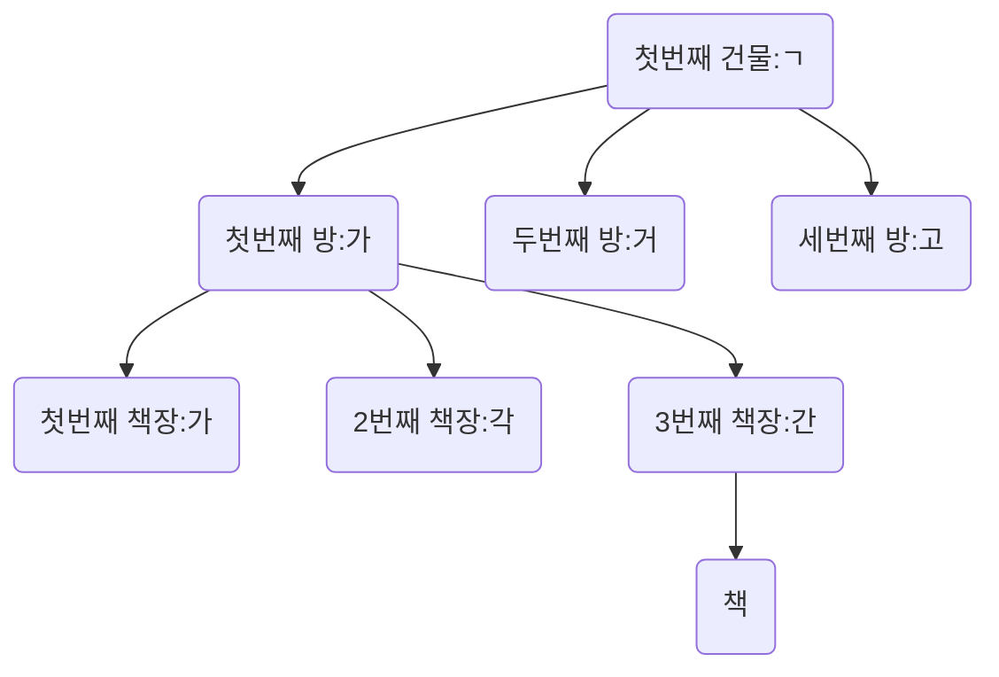

# Index

- 색인

## 얻을 수 있는 장점?

- MySQL이 데이터를 빠르게 찾기 위해서
  - SELECT가 빨라진다.

```sql
SELECT * FROM board WHERE id=1;
```

## 단점

- 무거워진다? => SELECT 이외의 DML이 느려진다.
- 용량을 차지한다? => 용량을 약 10% 더 먹는다.

# 색인

- 책 속의 내용 중에서 중요한 단어나 항목, 인명 따위를 쉽게 찾아볼 수 있도록 일정한 순서에 따라 별도로 배열하여 놓은 목록.

## Index를 설정하면

- 설정에 맞춰서 목록을 생성

# 왜 쓸까?

- 왜 빨리 찾아야할까?
  |num|name|
  |---|---|
  |1|김강문|
  |2|박성민|
  |3|방지완|

# Index를 자동으로 해주는 키?

- UNIQUE
- PRIMARY KEY
- FOREIGN KEY

# Index는 어떻게 빠르게 찾을 수 있는가? 목록화를 어떻게 하는가?

## 자료구조

- 순서대로 정리한다.
- 가나다 순으로 책을 정리한다.
  - 첫번째 건물 : ㄱ => 100만권
    - 첫번째 방 : 가
      - 첫번째 책장 : 가
      - 두번째 책장 : 각
      - 세번째 책장 : 간
    - 두번째 방 : 거
    - 세번째 방 : 고
  - 두번째 건물 : ㄴ

### B-Tree



- 닫

# Index test

```sql
CREATE TABLE board_test (
    id INT UNSIGNED PRIMARY KEY AUTO_INCREMENT,
    title VARCHAR(20) NOT NULL,
    created_at DATETIME DEFAULT NOW(),
    writer INT UNSIGNED,
    content VARCHAR(10000) NOT NULL,
    FOREIGN KEY (writer) REFERENCES user(id)
    ON UPDATE CASCADE
    ON DELETE SET NULL
); -- 약 36만개의 데이터가 포함되었다.
```

## CREATE INDEX

```sql
CREATE INDEX idx_board_title ON board_test(title DESC);
```

- ASC : 오름차순
- DESC : 내림차순

## SHOW INDEX

```sql
SHOW INDEX FROM board_test;
```

## DROP INDEX

```sql
DROP INDEX idx_board_title ON board_test;
```
