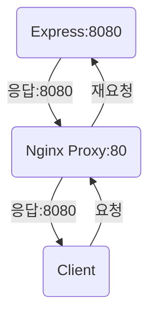
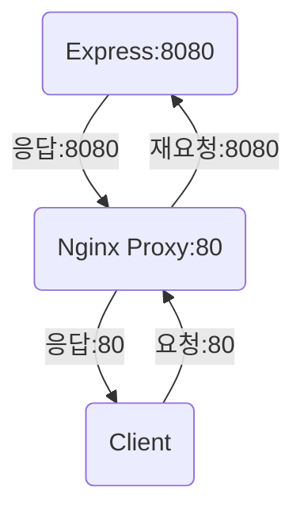

# NginX FrontEnd 배포

```bash
sudo apt-get update
sudo apt-get upgrade -y
sudo apt-get install nginx
```

# Node.js BackEnd 배포

```bash
curl -o- https://raw.githubusercontent.com/nvm-sh/nvm/v0.39.7/install.sh | bash

source ~/.bashrc
nvm install --lts
node -v
npm -v
```

# 파일 업로드

```bash
cd /var/www/
ls -al
# total 12
# drwxr-xr-x  3 root root 4096 Jun  5 00:20 .
# drwxr-xr-x 14 root root 4096 Jun  5 00:20 ..
# drwxr-xr-x  2 root root 4096 Jun  5 00:20 html
```

    - rwxr-xr-x << w, write 권한 없음

```bash
# /var/www
sudo chmod 777 html -R
ls -al
# total 12
# drwxr-xr-x  3 root root 4096 Jun  5 00:20 .
# drwxr-xr-x 14 root root 4096 Jun  5 00:20 ..
# drwxrwxrwx  2 root root 4096 Jun  5 00:20 html
```

# db 세팅

```bash
sudo apt-get install mysql-server -y
sudo mysql -u root -p # 비번 없이 엔터
```

```sql
ALTER USER 'root'@'localhost' IDENTIFIED WITH mysql_native_password BY '1234qwer!@#$';
-- 관리자 비번 변경

CREATE USER 'lj'@'localhost' IDENTIFIED WITH mysql_native_password BY '9457daAD!';
CREATE DATABASE LJ;
GRANT ALL PRIVILEGES ON LJ.* TO 'lj'@'localhost';

exit;
```

# Node 세팅

```bash
cd ~/server
npm i
npm start
```

# 서버를 정식으로 배포하기 위해서 백엔드에서 실행

- pm2 프레임워크를 사용

```bash
npm i pm2 -g
npm list -g

pm2 start server.js
pm2 list # 백그라운드에서 실행중인 js 확인
pm2 stop 0 # pm2 stop id
pm2 restart 0 # pm2 restart id
pm2 delete 0 # pm2 delete id
```

# Reverse Proxy 설정

```bash
cd /etc/nginx/sites-available/
sudo vi default
```

```
server {
    location / {

    }

    location /api {
        proxy_pass http://localhost:8080/api;
    }
}
```

```bash
sudo service nginx restart
```

# Proxy



- proxy : Client가 보낸 요청을 다른 서버에 다시 요청을 보내준다. 응답에 대해서 다른 서버가 보내준 사실을 클라이언트가 알고있다.

# Reverse Proxy


