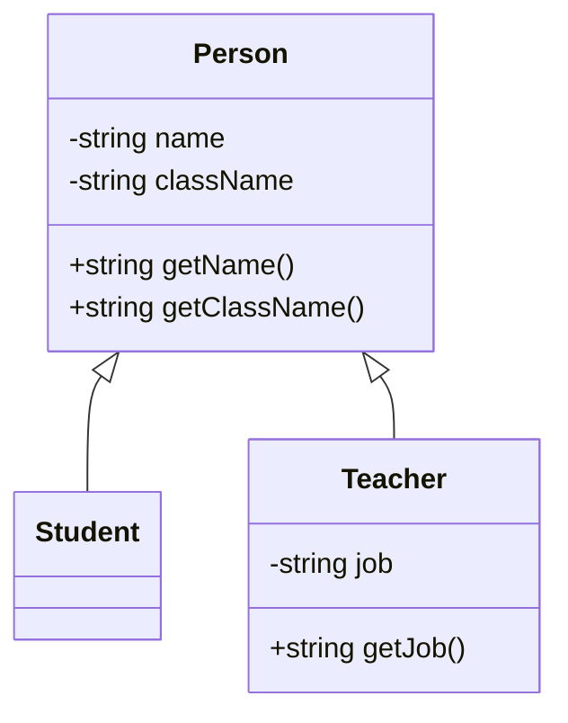

# 수업 내용

- 교과목 : (전공)프론트엔드 프로그램 개발하기
- 능력단위 : UI 구현
- 교재 : NCS 학습모듈 - 2

```bash
npm init -y
npm i -D webpack webpack-cli
npx webpack init
# webpack init 후 선택사항
y
Typescript
y
y
n
SASS
y
y
only for Production
y
npm
y
# 여기까지
npm run serve
```

# Class Diagram



# 객체지향 OOP

- SOLID

## S - SRP

- Single Resposibility Principle
- 단일 책임 원칙
- 하나의 클래스는 하나의 기능을 갖는다.

## O - OCP

- Open Closed Principle
- 개방-폐쇄 원칙
- 클래스는 변경에 있어서 닫혀있고 확장에 있어서 열려있어야한다.

## L - LSP

- Liskov Substitution Principle
- 리스코프 치환 원칙
- 상위 타입은 하위 타입으로 대체되어도 정상 동작하여야한다.

## I - ISP

- Interface Segregation Principle
- 인터페이스 분리 원칙
- 인터페이스는 명확하게 나눠져야한다.

## D - DIP

- Dependency Inversion Principle
- 의존 역전 원칙
- 의존 : 가져다 쓴다.
- Class를 가져다쓴다. -> Interface를 가져다 써라.
