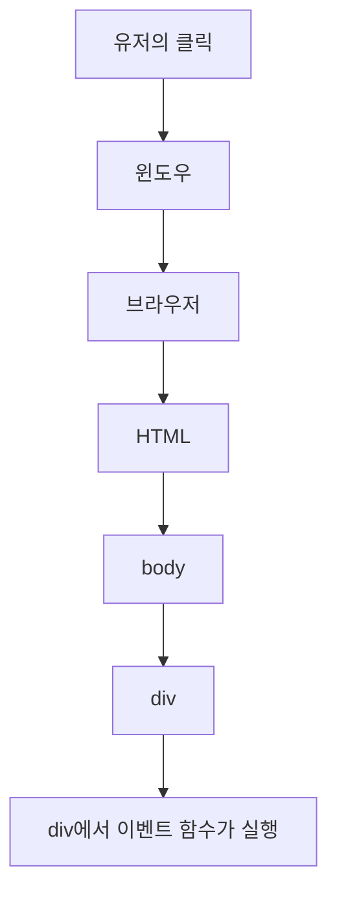

# BOM

- Browser Object Model
- 브라우저의 정보를 가지고 있는 객체
- 주소(url), 웹페이지 이동 기록, ...
- location : 주소 관련
- history : 웹페이지 이동 기록

# DOM

- Document Object Model
- HTML에 대한 정보를 갖고있다.

# Event

- 이벤트 함수를 언제 실행한다고 알 수 있을까? --> 무엇을 실행할까?
