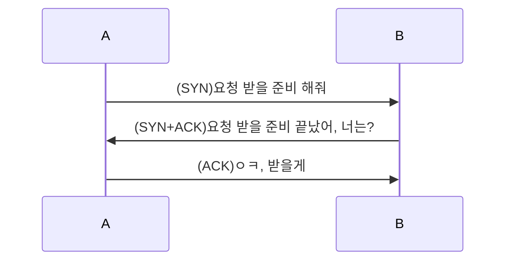
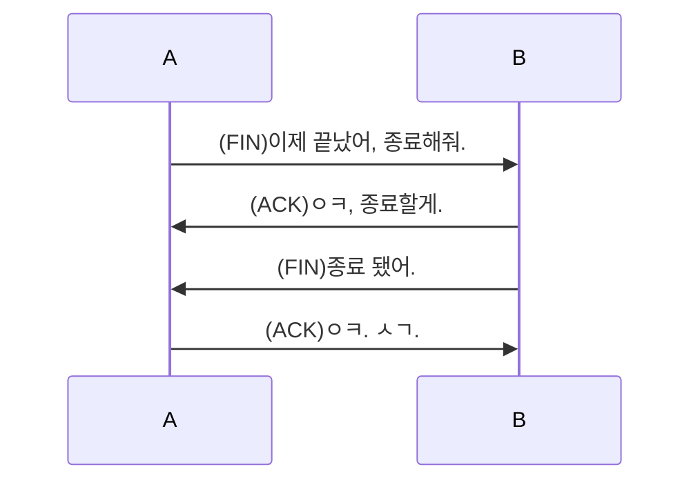

# OSI 7 계층

1. 물리 계층(Physical Layer)
2. 데이터 링크 계층(DataLink Layer)
3. 네트워크 계층(Network Layer)
4. 전송 계층(Transport Layer)
5. 세션 계층(Session Layer)
6. 표현 계층(Presentation Layer)
7. 응용 계층(Application Layer)

# TCP/IP 4 계층

1. Network Interface
2. Internet
3. Transport
4. Application

# TCP/IP 5 계층

1. Physical
2. DataLink
3. Network
4. Transport
5. Application

- 인터넷에서 이미지를 받을려고 한다. -> 이미지가 다운이 안된다.
  - 원인 파악
    1. 랜선이 잘 꽂혀있는지? -> Physical Layer 이슈
    2. 인터넷 연결이 잘 되어있는지? -> 컴퓨터에 IP 주소가 없다면 -> Network Layer 이슈
    3. HTTP = { Header: { IP, accept, Content-Type, Content-Length }, Body: "<html></html>" } -> Content-Type이 잘못되거나 요청을 보낼 때 잘못 보냈거나 Content-Length의 길이가 잘못 됐거나 -> Application Layer 이슈
  - 해결 방안
    1. 랜선 꽂는다. Wifi 잡는다.
    2. 공유기 확인
    3. 헤더 수정(정확한 데이터), Body 확인

# TCP | UDP 차이

## TCP

- 서로 간에 확인을 거치는 통신

### 3 HandShake

- 서로 간에 데이터를 받을 수 있게 연결한다.

### 4 HandShake

- 서로 간에 데이터 통신이 끝났으니 종료한다.

## UDP

- 데이터를 보내고 끝

## TCP VS UDP

- 속도: TCP < UDP
- 안정성: TCP > UDP
- 게임 만들 때: TCP < UDP, 빠르니까
  - 요즘엔: TCP > UDP

# HTTP 이론

- Header
  - Method
  - accept
  - Content-Type
  - Content-Length
  - ...
- Body

## Method

- 요청의 종류

### GET

- 평소 우리가 쓰는 거.
- 정보를 받아오기 위해 사용

### POST

- 로그인 등등 정보를 보내기 위해 사용

### PUT

- 정보 전체를 수정 요청을 보내기 위해 사용

### PATCH

- 정보의 일부를 수정 요청을 보내기 위해 사용

### DELETE

- 정보를 삭제 요청을 보내기 위해 사용

### OPTION

- POST 등 정보 수정 등등을 요청 보낼 때 선요청으로 인증 절차 등을 진행하기 위해 사용

# REST API(RESTFUL API)

- Method를 적절히 사용하여 통신하는 방식
- HTTP 통신의 기초

# WSL / Ubuntu

## WSL

- Windows SubSystem Linux
  - Linux용 Windows 하위 시스템
- Hyper-V
  - 가상 머신 플랫폼
  - Virtual Machine
- WSL VS WSL2
  - Version: 1 VS 2
  - Base: WinAPI VS Kernel(VM)
- Windows에서 사용하다가 그대로 AWS 같은 클라우드에서 Ubuntu 등으로 사용하려면 WSL2
  가 좋음

## Ubuntu

- Linux의 커스텀 OS(오픈 소스)
- Linux: Kernel 기반의 오픈 소스 OS
  - Unix 계열의 OS
- Linux의 OS: centOS, redHet, Linux for AWS

# 방화벽

- 80 port(HTTP)를 방화벽에서 설정해주면 열어서 타인이 내 컴퓨터에 요청을 보낼 수 있다.
- 443 port(HTTPS)
- mySQL: 3306
