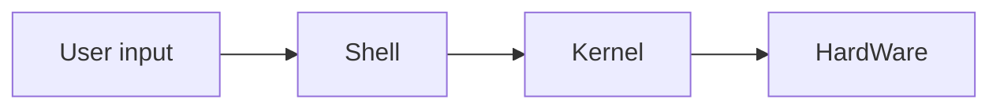

# Ubuntu

- Linux 기반 OS
  - Unix 계열
  - 오픈 소스
- Command Line Interface 환경
  - GUI와 대비
  - 명령어로 프로그램 실행

## 구조



## 설치

- WSL 설치

  - Linux용 Windows 하위 시스템
    - Windows SuvSystem Linux
  - Hyper-v
    - 가상 머신 플랫폼

- Ubuntu 설치
  ```bash
  wsl --install -d Ubuntu
  ```

## ls

```bash
drwxr-x--- 1 ubuntu ubuntu 4096 Mar  8 09:23 .
drwxr-xr-x 1 root   root   4096 Mar  8 09:22 ..
-rw-r--r-- 1 ubuntu ubuntu  220 Mar  8 09:22 .bash_logout
-rw-r--r-- 1 ubuntu ubuntu 3771 Mar  8 09:22 .bashrc
-rw-r--r-- 1 ubuntu ubuntu    0 Mar  8 09:23 .motd_shown
-rw-r--r-- 1 ubuntu ubuntu  807 Mar  8 09:22 .profile
```

- 제일 앞에 있는 것 (drwxr-x---) 권한을 의미한다.
  - d : Directory, 폴더
  - `-`는 파일?
- rwx | rwx | rwx << 귄한
  - `-` 비어있음
  - r : read
  - w : write
  - x : execute
  - 소유자, 그룹, 제 3자

## vi

```bash
vi test.txt
```

- 메모장
- 아래에 현재 모드에 대해서 적혀있다.
  - `i` 누르면 `--Insert--`로 바뀌고 입력 모드
  - `esc` 누르면 비어지며 통상 모드
    - 통상 모드 시 저장, 종료 가능
  - `:` 를 누르면 파일의 저장 | 종료 등 명령어를 입력할 수 있다.
  - `:q` : 종료
  - `:w` : 쓰기
  - `:wq` : 쓰고 종료
  - `!` : 강제 << 관리자 권한으로 실행
  - `:wq!` : 강제로 저장하고 종료한다.
  - `:q!` : 강제로 종료한다 << 수정 후 수정사항 날릴 때

## vim

- 메모장

# NginX

- 설치

```shell
sudo apt-get update
sudo apt-get upgrade
sudo apt-get install nginx
```

- 확인

```shell
sudo service nginx status
sudo service nginx start
```

```conf
location / {
  root /Documents/...
}
```
